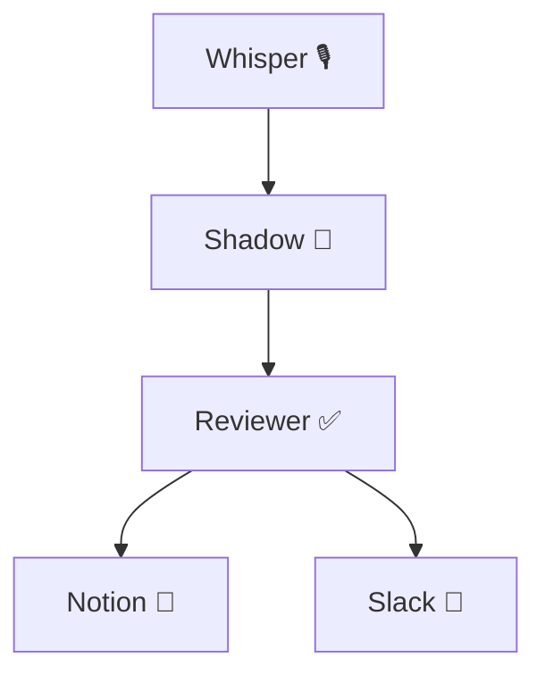

# 🧠 Shadow Multi-Agent AI System (Coral Protocol)

An autonomous multi-agent AI system built on [Coral Protocol](https://github.com/Coral-Protocol), integrating:

- **Shadow Agent** (code generation / task handler)
- **Reviewer Agent** (evaluation and feedback)
- **Whisper Agent** (voice-to-text)
- **Notion Agent** (journaling and log sync)
- **Slack Agent** (team notifications)
- Visual wiring via Coral Studio's scenario builder

---

## 🚀 Quick Start

### 1. Clone & Configure

```bash
git clone https://github.com/sahiixx/Coral-BlackboxAI-Agent.git shadow-agent
cd shadow-agent
cp ../agents-template.env .env  # Use your actual credentials here
```

### 2. Run via Docker Compose

```bash
docker-compose -f docker-compose-shadow.yml up --build
```

Studio: [http://localhost:3000](http://localhost:3000)  
Server: [http://localhost:8080](http://localhost:8080)

---

## 🌐 Agents Overview

| Agent          | Role                            | Model               |
|----------------|----------------------------------|---------------------|
| `shadow_agent` | Task/code generator             | GPT-4.1-mini        |
| `reviewer_agent` | Validates and gives feedback   | GPT-3.5             |
| `whisper_agent` | Converts audio to text          | Whisper / OpenAI    |
| `notion_agent` | Logs to Notion DB               | Notion API          |
| `slack_agent`  | Sends messages to Slack channel | Slack Bot API       |

---

## 🛠 Environment Variables

See [`agents-template.env`](./agents-template.env)

```env
SHADOW_API_KEY=...
WHISPER_API_KEY=...
NOTION_API_KEY=...
SLACK_BOT_TOKEN=...
```

---

## 📒 Scenario

Use [`shadow-scenario.json`](./shadow-scenario.json) in Coral Studio to visualize:



---

## 📦 Deployment CI/CD (GitHub Actions)

1. Create `.github/workflows/deploy.yml`
2. Add build-and-push steps
3. Connect secrets: `DOCKERHUB_USERNAME`, `DOCKERHUB_TOKEN`

---

## 📁 Directory Layout

```
.
├── Dockerfile
├── docker-compose-shadow.yml
├── application-shadow.yaml
├── shadow-scenario.json
├── agents-template.env
├── sample-agent-transcript.json
```

---

## 🤝 Credits

Built with ❤️ by [@sahiix](https://github.com/sahiixx)  
Based on [Coral Protocol](https://github.com/Coral-Protocol)